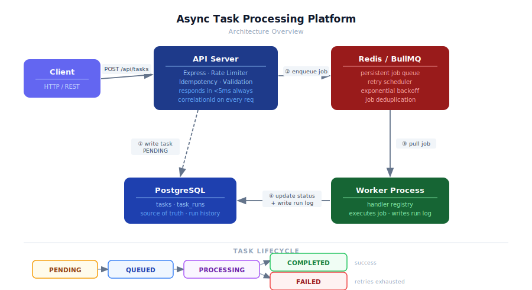
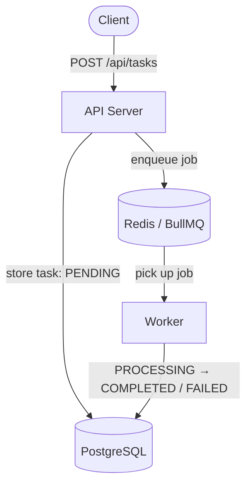

# Async Task Processing Platform

> Production-grade async job processing system with retries, idempotency, and distributed worker architecture — inspired by Celery, Sidekiq, and AWS SQS.

[](https://nodejs.org)
[](https://typescriptlang.org)
[](https://postgresql.org)
[](https://redis.io)
[](https://docker.com)
[](#)

---

## ⚡ Quick Demo

```
POST /api/tasks      →  instant response  (status: QUEUED)
Worker               →  processes in background (~1s)
GET  /api/tasks/:id  →  status: COMPLETED, result: {...}
```

Retries, idempotency, and crash recovery built in. [See full demo ↓](#-demo-flow)

---

## 🚀 Why This Project

Real production systems handle **slow, failure-prone, or high-volume work** without blocking users. This project implements the task queue pattern used across the industry:

| Without async queue | With this system |
|---|---|
| API blocks until job finishes | API responds in `<5ms`, always |
| Crash = lost work | Jobs persist in Redis, retry automatically |
| Duplicate request = duplicate work | Idempotency-Key prevents duplicates |
| No failure visibility | Every attempt logged with error + timestamp |
| Scale by making API slower | Scale by adding workers independently |

**Where this pattern appears in production:**
`Stripe` payment retries · `Uber` dispatch queues · `GitHub` CI job runners · `Shopify` order processing

---

## 🧠 Architecture



> **To recreate this diagram** in draw.io or Excalidraw, see [`docs/diagram-instructions.md`](./docs/diagram-instructions.md)



**Task lifecycle:** `PENDING → QUEUED → PROCESSING → COMPLETED / FAILED`

**Component responsibilities:**

| Component | Role |
|---|---|
| **API Server** | Validates input, writes task to DB, pushes job to Redis, responds instantly |
| **Redis / BullMQ** | Persists jobs, manages retry scheduling, distributes to workers |
| **Worker** | Pulls jobs, executes handlers, writes per-attempt run logs to DB |
| **PostgreSQL** | Source of truth — task state, payload, result, full run history |

---

## 🔥 Demo Flow

A real end-to-end interaction showing every layer working together.

**Step 1 — Client submits a task**

```bash
curl -X POST http://localhost:3000/api/tasks \
  -H "Content-Type: application/json" \
  -H "Idempotency-Key: payment-order-789" \
  -d '{"type": "example", "payload": {"orderId": "789", "amount": 149.99}}'
```

API responds instantly (`<5ms`) — job is queued, not yet processed:

```json
{
  "id": "c7f3a1b2-4d5e-6f78-9012-abcdef345678",
  "type": "example",
  "status": "QUEUED",
  "payload": { "orderId": "789", "amount": 149.99 },
  "result": null,
  "idempotencyKey": "payment-order-789",
  "createdAt": "2026-04-30T10:00:00.000Z"
}
```

**Step 2 — Worker picks up the job** (happens automatically, ~1 second later)

Worker logs emitted during processing:
```json
{"level":"info",  "taskId":"c7f3a1b2", "jobId":"c7f3a1b2", "attemptNumber":1, "msg":"Processing task"}
{"level":"info",  "taskId":"c7f3a1b2", "jobId":"c7f3a1b2", "attemptNumber":1, "msg":"Task completed"}
```

**Step 3 — Client polls for result**

```bash
curl http://localhost:3000/api/tasks/c7f3a1b2-4d5e-6f78-9012-abcdef345678
```

```json
{
  "id": "c7f3a1b2-4d5e-6f78-9012-abcdef345678",
  "type": "example",
  "status": "COMPLETED",
  "result": { "processed": true, "receivedKeys": ["orderId", "amount"] },
  "runs": [
    {
      "attemptNumber": 1,
      "status": "COMPLETED",
      "startedAt": "2026-04-30T10:00:00.118Z",
      "completedAt": "2026-04-30T10:00:00.241Z",
      "errorMessage": null
    }
  ]
}
```

**Idempotency — same key, second request:**
```bash
# Returns the exact same task ID — no duplicate created
curl -X POST http://localhost:3000/api/tasks \
  -H "Idempotency-Key: payment-order-789" \
  -d '{"type": "example", "payload": {"orderId": "789", "amount": 149.99}}'
# → same "id": "c7f3a1b2-..." returned
```

---

## 📊 Example Logs

Structured JSON emitted by the worker — searchable, parseable, production-ready:

```json
{"level":"info","taskId":"c7f3a1b2","jobId":"c7f3a1b2","attemptNumber":1,"msg":"Processing task"}
{"level":"info","taskId":"c7f3a1b2","jobId":"c7f3a1b2","attemptNumber":1,"msg":"Task completed"}
```

On failure (before retry):
```json
{"level":"error","taskId":"c7f3a1b2","jobId":"c7f3a1b2","attemptNumber":1,"error":"Handler threw","retriesLeft":2,"msg":"Task attempt failed — will retry"}
```

---

## 🧠 Design Decisions

- **Queue over synchronous processing** — decouples API response time from job duration; API returns in `<5ms` regardless of how long the job takes; workers scale independently
- **No DB + Redis transaction** — they can't share ACID transactions; partial failures are handled explicitly: enqueue failure leaves task `PENDING` (recoverable), DB failure after enqueue is logged with `jobId` for audit
- **Three-layer idempotency** — ① service-layer key lookup before insert → ② DB unique constraint as hard guarantee → ③ `P2002` catch for race conditions; BullMQ also deduplicates via `jobId = taskId`
- **Retries delegated to BullMQ** — retry scheduler lives in Redis, survives app crashes; exponential backoff (2s → 4s → 8s) requires no application timers or manual state
- **Separate worker process** — API stays available if workers crash or redeploy; neither process starves the other under load

---

## ⚠️ Failure Scenarios Handled

| Scenario | Detection | Resolution |
|---|---|---|
| **Worker crashes mid-job** | BullMQ job stays in `active` state | Re-queued automatically on worker restart |
| **Duplicate API requests** | `Idempotency-Key` header match | Returns existing task — no second write |
| **Race condition on idempotency key** | `P2002` unique constraint violation | Caught explicitly — resolves to first task |
| **Redis re-delivers a completed job** | Worker reads task status from DB | Skips execution if `COMPLETED` or `FAILED` |
| **Handler throws on attempt 1 or 2** | Error caught in processor | Run marked `FAILED`, BullMQ schedules retry |
| **Handler throws on attempt 3 (last)** | `isLastAttempt` flag checked | Task permanently `FAILED`, error stored |
| **Enqueue succeeds, DB update fails** | `updateStatus` try/catch | Inconsistency logged with `jobId` for audit |
| **SIGTERM during active requests** | `process.on('SIGTERM')` handler | Server drains, queue closes, Prisma disconnects |
| **Missing env variable at startup** | Fail-fast config validation | Process exits with clear error before serving traffic |

---

## ✨ Features

**Core**
- Decoupled API and worker — deploy, scale, and restart independently
- 5-state task lifecycle: `PENDING → QUEUED → PROCESSING → COMPLETED / FAILED`
- `task_runs` table: every attempt logged with start time, end time, and error
- Extensible handler registry — register a new task type in one line

**Reliability**
- Exponential backoff retry: 3 attempts at 2s → 4s → 8s (BullMQ-managed)
- Two-layer idempotency: application-level + DB unique constraint + P2002 race guard
- Double-execution guard: finalized-task check before any work begins
- Graceful SIGTERM shutdown with 10-second force-exit fallback

**Production-grade**
- Structured JSON logging (Pino) — `taskId`, `jobId`, `correlationId` on every line
- Sliding-window rate limiting on `POST /api/tasks`
- Fail-fast env validation — crashes loudly at startup, not silently in production
- Multi-stage Docker build (Alpine + OpenSSL) with health-check-gated service startup
- 30 automated tests: unit (full mock isolation) + integration (real PostgreSQL + Supertest)

---

## ⚡ Key Strengths

- Handles retries, failures, and crash recovery correctly — no manual logic
- Prevents duplicate execution: idempotency key + DB constraint + worker finalized-task guard
- Fully observable: every log line carries `taskId`, `jobId`, `correlationId`
- Designed for horizontal scaling — add workers with zero config changes

---

## ⚙️ Key Technical Decisions

| Decision | Choice | Reason |
|---|---|---|
| Queue | BullMQ | Redis-backed persistence, retry/backoff, job dedup built-in |
| Database | PostgreSQL | ACID guarantees for task state; relational integrity for runs |
| ORM | Prisma | Type-safe queries, generated client, migration management |
| Logger | Pino | Structured JSON output, lowest overhead of any Node.js logger |
| Worker isolation | Separate process | API stays available if workers crash or are redeployed |
| Job identity | `jobId = taskId` | Prevents same task entering the queue twice |
| Test runner | Vitest | Native TypeScript, fast, Jest-compatible API |

---

## 📈 Scalability

```
                    ┌─────────┐
                    │  API 1  │──┐
                    └─────────┘  │         ┌───────────┐
                                 ├────────▶│   Redis   │◀──▶ Worker 1
                    ┌─────────┐  │         │  (Queue)  │◀──▶ Worker 2
                    │  API 2  │──┘         └───────────┘◀──▶ Worker N
                    └─────────┘
```

- **Stateless API** — any number of API instances can run behind a load balancer; no shared in-memory state
- **Horizontal worker scaling** — add worker instances; BullMQ distributes jobs with no config changes
- **Queue as traffic buffer** — request spikes accumulate in Redis; workers drain at their own pace, zero job loss
- **Per-worker concurrency** — each worker processes up to 5 jobs in parallel (`WORKER_CONCURRENCY` env var)
- **Independent scaling** — CPU-heavy workloads → scale workers; high request volume → scale API; no coupling

---

## 🛠️ Tech Stack

| Layer | Technology | Version |
|---|---|---|
| Runtime | Node.js + TypeScript | 20 / 5 |
| HTTP | Express | 4 |
| Queue | BullMQ | 5 |
| Broker | Redis | 7 |
| Database | PostgreSQL | 16 |
| ORM | Prisma | 5 |
| Logging | Pino + pino-pretty | 9 |
| Testing | Vitest + Supertest | — |
| Container | Docker + Compose | — |

---

## 🚀 Running the Project

### Docker — zero setup, one command

```bash
git clone https://github.com/THOKALA-SRAVAN/async-task-processing-platform.git
cd async-task-processing-platform
docker-compose up --build -d
```

All 4 services start with health-check-gated ordering (Postgres → Redis → API + Worker).

```bash
curl http://localhost:3000/health
# {"status":"ok","uptime":18.4,"timestamp":"..."}
```

### Local Node.js

```bash
npm install
npm run db:migrate        # requires PostgreSQL + Redis running locally
```
```bash
npm run dev:api           # Terminal 1 — API on :3000
npm run dev:worker        # Terminal 2 — Worker
```

### Tests

```bash
npm test                  # all 30 tests
npm run test:unit         # unit only — no DB or Redis needed
npm run test:integration  # hits real PostgreSQL
npm run test:coverage     # with coverage report
```

---

## 📁 Project Structure

```
src/
├── app.ts                             # Express app (no server.listen — testable)
├── server.ts                          # Entry point: listen + graceful shutdown
├── config/index.ts                    # Fail-fast env validation
├── lib/                               # logger · prisma singleton · redis options
├── types/task.types.ts                # Shared domain types
├── repositories/                      # Data access: task + taskRun
├── services/task.service.ts           # Business logic, idempotency, orchestration
├── api/
│   ├── controllers/task.controller.ts # HTTP validation + response shaping
│   ├── routes/task.routes.ts          # Router + rate limiter
│   └── middlewares/error.middleware.ts# Prisma errors → HTTP status codes
├── queue/task.queue.ts                # BullMQ Queue + enqueueTask()
└── worker/
    ├── worker.ts                      # BullMQ Worker + shutdown
    └── processors/task.processor.ts  # Handler registry + execution + retry logic

prisma/
├── schema.prisma                      # Task + TaskRun models, enums, indexes
└── migrations/                        # Version-controlled schema history

src/__tests__/
├── setup/global.ts                    # Create test DB + run migrations before suite
├── unit/                              # Full mock isolation (no I/O)
└── integration/                       # Supertest + real PostgreSQL
```

---

## 🔌 Extending — Add a New Task Type

One file change. Register a handler in [`src/worker/processors/task.processor.ts`](src/worker/processors/task.processor.ts):

```typescript
const handlers: Record<string, TaskHandler> = {
  example: async (payload) => { ... },

  // Add here ↓
  send_email: async (payload) => {
    const { to, subject, body } = payload as { to: string; subject: string; body: string };
    await emailClient.send({ to, subject, body });
    return { sent: true, recipient: to };
  },
};
```

Then: `POST /api/tasks` with `"type": "send_email"` — the queue, retry, and logging all work automatically.

---

## 📬 API Reference

| Method | Endpoint | Description |
|---|---|---|
| `GET` | `/health` | Health + uptime |
| `POST` | `/api/tasks` | Create task · supports `Idempotency-Key` header |
| `GET` | `/api/tasks` | List tasks · `?status=` `?limit=` `?offset=` |
| `GET` | `/api/tasks/:id` | Task detail + full `runs` history |
